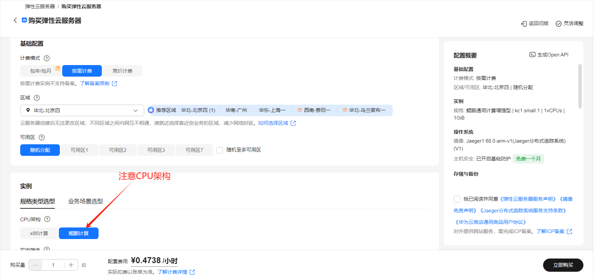
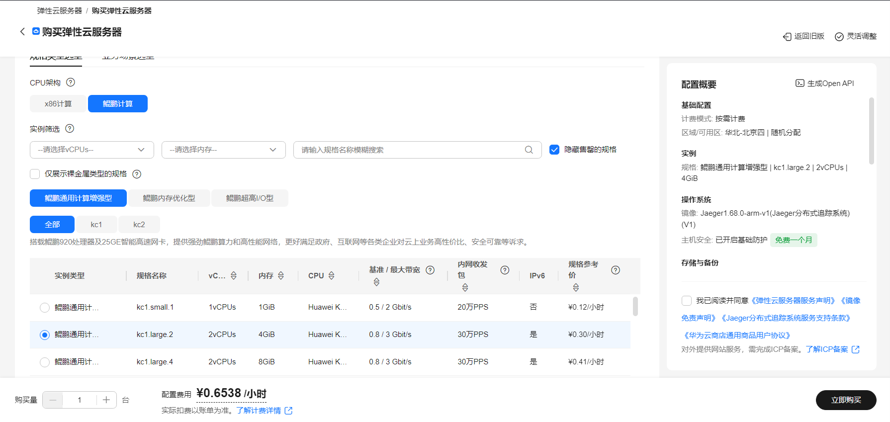
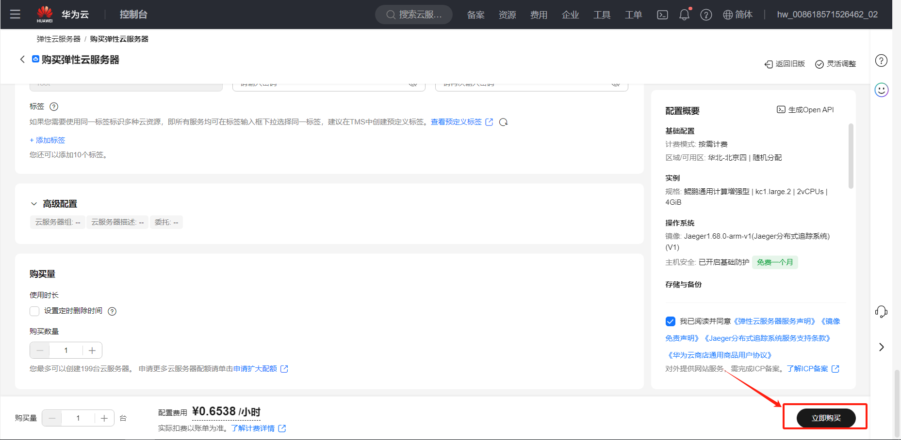

# Yambo使用指南

# 一、商品链接

# 二、商品说明

Yambo是一个基于多体微扰理论和时间依赖密度泛函理论的材料性质预测软件，它实现了基于格林函数论的第一性原理方法俩描述现实材料的激发态特性。

本商品通过鲲鹏服务器+Huawei Cloud EulerOS 2.0 64bit进行安装部署。

# 三、商品购买

您可以在云商店搜索Yambo找到该商品。

其中，地域、规格、推荐配置使用默认，购买方式根据您的需求选择按需/按月/按年，短期使用推荐按需，长期使用推荐按月/按年，确认配置后点击“立即购买”。

# 四、商品资源配置

本商品支持ECS控制台配置，下面进行介绍。

# 4.1 ECS 控制台配置

### 准备工作

在使用ECS控制台配置前，需要您提前配置好 **安全组规则**。

> **安全组规则的配置如下：**
>
> - 入方向规则放通 CloudShell 连接实例使用的端口 `22`，以便在控制台登录调试
> - 出方向规则一键放通

### 创建ECS

前提工作准备好后，在 ECS 控制台配置跳转到[购买ECS](https://support.huaweicloud.com/qs-ecs/ecs_01_0103.html) 页面，ECS 资源的配置如下图所示：

选择CPU架构

选择服务器规格

选择镜像规格

其他参数根据实际情况进行填写，填写完成之后，点击立即购买即可


> **值得注意的是：**
>
> - VPC 您可以自行创建
> - 安全组选择 [**准备工作**](#准备工作) 中配置的安全组；
> - 弹性公网IP选择现在购买，推荐选择“按流量计费”，带宽大小可设置为5Mbit/s；
> - 高级配置需要在高级选项支持注入自定义数据，所以登录凭证不能选择“密码”，选择创建后设置；
> - 其余默认或按规则填写即可。

# 五、商品使用

## Yambo使用
基于第一性原理，Yambo软件以基础泛函理论（DFT）为基础，通过多体物理理论计算更加精确的材料电子激发特性与光学响应特性。因此，在实际工作中需要基于DFT计算软件，如Quantum ESPRESSO（QE）或ABINIT生成的数据作为程序输入文件。

本商品提供两个规格的镜像，本规格Yambo-5.3.0-kunpeng-HCE不包含DFT软件，需要准备好DFT计算后的数据文件。Yambo-5.3.0-QE-7.3-kunpeng-HCE镜像打包了QE软件，下面的示例演示中涉及DFT数据计算部分以该规格为准。

### 数据准备
登录服务器，进入命令行，下载解压官方提供的示例数据：
```
$ wget https://media.yambo-code.eu/educational/tutorials/files/hBN.tar.gz
$ tar -xzf hBN.tar.gz
```
### DFT计算
进入PWSCF文件夹，执行SCF与非SCF计算：
```
$ cd hBN/PWSCF
$ pw.x < hBN_nscf.in > hBN_scf.out
$ pw.x < hBN_nscf.in > hBN_nscf.out
```
此时您将获得hBN.save文件夹：
```
$ ls hBN.save
data-file.xml charge-density.dat gvectors.dat B.pz-vbc.UPF N.pz-vbc.UPF
K00001	K00002 .... 	K00035	K00036
```
使用Yambo的p2y命令，将DFT计算后的输出文件转换为Yambo的格式：
```
$ cd hBN.save
$ p2y
```
您已经完成了Yambo输入数据的生成，位于SAVE目录下，可使用-D命令查看：
```
$ yambo -D
[RD./SAVE//ns.db1]------------------------------------------
Bands                           : 100
K-points                        : 14
G-vectors             [RL space]:  8029
Components       [wavefunctions]: 1016
...
[RD./SAVE//ns.wf]-------------------------------------------
Fragmentation                    :yes
...
[RD./SAVE//ns.kb_pp_pwscf]----------------------------------
Fragmentation                    :yes
- S/N 006626 -------------------------- v.04.01.02 r.00000 -
```
### Yambo初始化
这里，我们使用官方准备的`SAVE`文件夹进行演示，在其上级文件夹输入`yambo`指令。运行目录下将生成报告文件`r_setup`，`SAVE`文件夹下将生成两个新文件：`ndb.gops`，`ndb.kindx`。
```
$ cd ../../YAMBO
$ yambo
<---> [01] MPI/OPENMP structure, Files & I/O Directories
<---> [02] CORE Variables Setup
<---> [02.01] Unit cells
<---> [02.02] Symmetries
<---> [02.03] Reciprocal space
…
<---> [04] Timing Overview
<---> [05] Memory Overview
<---> [06] Game Over & Game summary
```
### 粒子光谱计算
初始化后，输入yambo -F yambo.in_IP -o c命令，将创建并打开配置文件。对配置文件进行修改，如下所示：
```
% QpntsRXd
 1 |  1 |                   # [Xd] Transferred momenta
%
ETStpsXd= 1001               # [Xd] Total Energy steps
```
保存退出后，执行yambo -F yambo.in_IP -J Full命令生成平滑光谱；然后执行yambo -F yambo.in_IP -J 6Ry -V RL -o c，更改下面一行的参数后，再执行yambo -F yambo.in_IP -J 6Ry对能量进行截断重新计算。
```
FFTGvecs= 6           Ry    # [FFT] Plane-waves
```
您可以使用gnuplot（可使用sudo yum install gnuplot安装）对结果进行绘制并保存：
```
$ gnuplot
gnuplot> set terminal jpg
gnuplot> set output 'result.jpg'
gnuplot> plot "o-Full.eps_q1_ip" w l,"o-6Ry.eps_q1_ip" w p
gnuplot> q
```
运行目录下，可查看result.jpg如下所示：

## 参考文档
- [Yambo官方wiki教程](https://wiki.yambo-code.eu/wiki/index.php?title=Tutorials)


